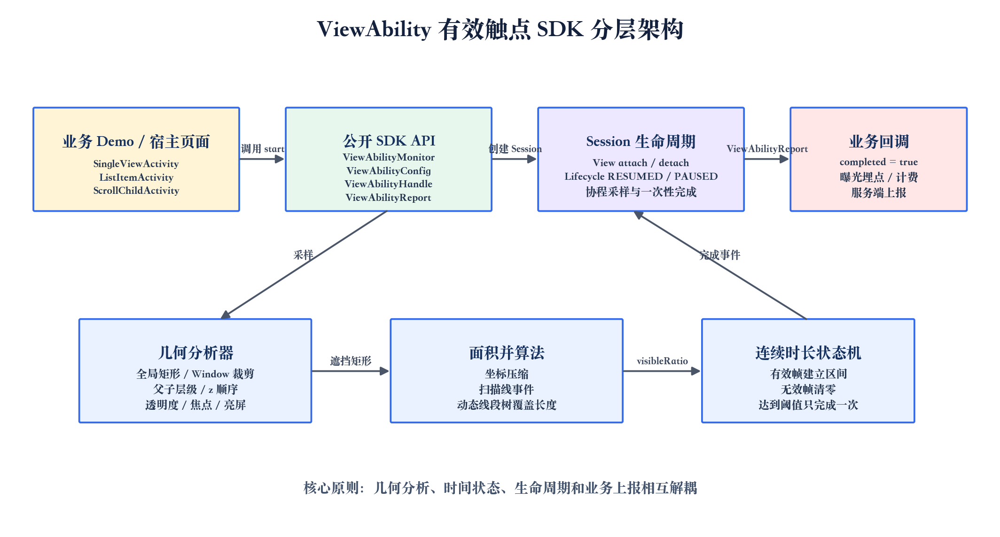
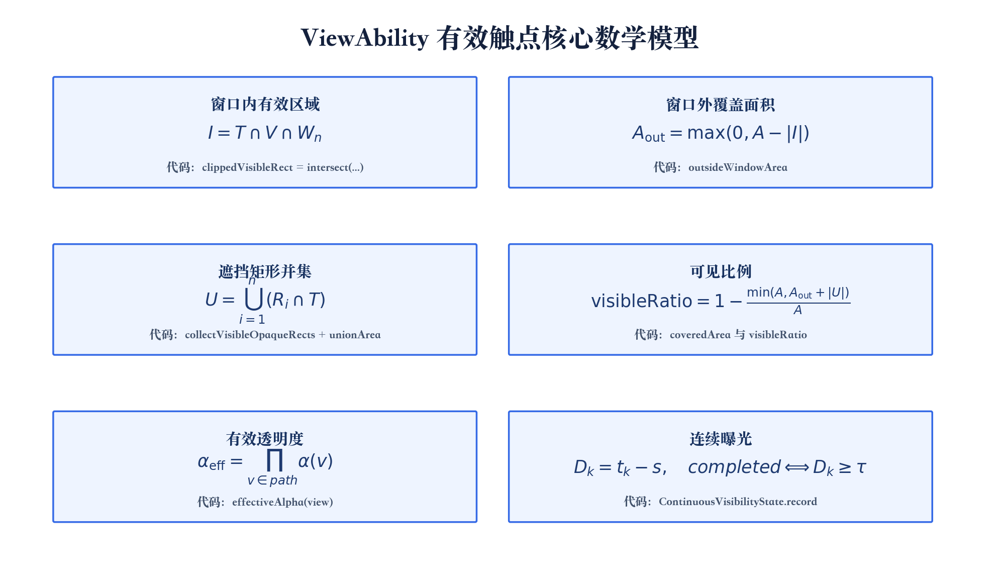
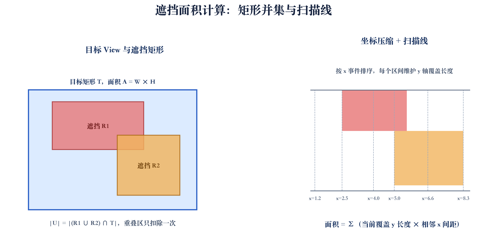
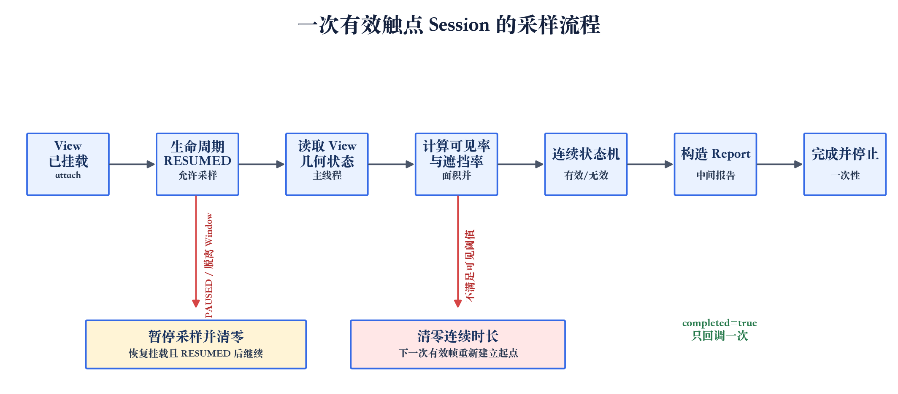

# Android 有效触点框架 ViewAbility：从“View 可见”到“曝光可证明”

## 摘要：有效触点是什么，为什么必须做

有效触点（Viewability）描述的是一次广告或商业内容是否真正进入了用户的可视范围：目标 View 在当前 Window 中需要有足够比例的面积可见，并且连续保持业务规定的时间。它不是“View 创建成功”的同义词，也不是“View.VISIBLE 为真”的同义词。

移动端广告经常遇到这些情况：View 已经布局但仍在屏幕外；只有一部分进入窗口；上面被弹窗、浮层或同层兄弟 View 遮挡；页面已经暂停或 Window 失去焦点；RecyclerView 回收了原来的 ViewHolder；设备已经熄屏但 View 树仍然存在。如果这些状态被错误计算为曝光，会造成虚高的曝光数、错误计费和不可信的归因；如果判断过于保守，又会漏掉真实展示。

所以有效触点框架要同时回答三个问题：当前 View 在 Window 内有多少有效面积、哪些区域被已知不透明对象覆盖、可见条件是否连续满足一段时间。ViewAbility 将问题拆成几层：几何分析器负责空间事实，连续状态机负责时间事实，Session 负责 View 和页面生命周期，业务只接收稳定的 `ViewAbilityReport`，并在 `completed == true` 时上报一次有效曝光。

本文不只介绍概念，而是把公式、核心 Kotlin 代码、协程流程和工程取舍放在一起，说明一个有效触点 SDK 为什么要这样设计，以及它在哪里应该保守、在哪里需要业务扩展。

## 一、问题定义和工程目标

### 1.1 业务痛点

最常见的错误实现只判断 `visibility`、`isShown` 或 `getGlobalVisibleRect` 的返回值。这些 API 只能说明 View 存在某个可见矩形，不能直接告诉我们“可见面积是多少”，更不能处理多个遮挡矩形的重叠。

另一个常见错误是使用计数器模拟连续时间，例如每采样一次就加一个固定的 100ms。线程调度、布局动画和主线程繁忙都会让采样间隔产生偏差；如果期间发生一次遮挡或页面暂停，旧计数又不能继续保留。

列表场景还会带来对象复用问题。RecyclerView 的 ViewHolder 是容器，不是广告身份。同一个 Item View 可能先承载广告，滚出屏幕后又被绑定为普通内容。如果 Session 没有在回收和重新绑定时更新，曝光事件就会串到错误的 impressionId。

### 1.2 设计目标

ViewAbility 的目标是在普通 Android View 树范围内提供可解释的几何估算，并明确能力边界：

- 业务只传入真实 View、唯一 `impressionId`、配置和回调；
- 每次报告都有可见比例、覆盖比例、原因和连续时长；
- 面积并集不重复扣除，矩形数量动态扩容；
- 时间状态可作为纯 Kotlin 类单独测试；
- View attach、Lifecycle、Session close 和完成事件有统一释放路径；
- 支持固定广告位、RecyclerView Item 和滚动容器等常见 View 接入形态。

## 二、架构：四层职责和一次展示的边界

ViewAbility 的结构可以概括为四层：业务页面层、公开 API 层、Session 生命周期层和内部算法层。



业务层通过 `ViewAbilityMonitor.start` 发起一次展示。公开 API 只暴露四个核心类型：`ViewAbilityMonitor`、`ViewAbilityConfig`、`ViewAbilityReport` 和 `ViewAbilityHandle`。Session 负责采样协程、View attach/detach、Lifecycle RESUMED/PAUSED 和一次性完成。内部算法负责读取 View 几何、收集不透明遮挡物、计算矩形并集并推进连续时间状态。

Session 对应的是“一次广告展示”，不是“一颗 View”。因此 `impressionId` 是业务幂等键，`ViewAbilityHandle` 是资源句柄。相同 ID 再次 `start` 时，旧任务会先关闭；View 被回收、广告被替换或页面销毁时，业务调用 `handle.close()`。句柄关闭是幂等的，Session 使用弱引用保存目标 View，避免列表缓存反向延长 View 生命周期。

### API 代码：从业务 View 创建 Session

下面代码是 SDK 的核心接入方式。配置在构造时校验，`Duration` 避免把秒和毫秒混淆；`notifyIntermediateSamples` 在生产环境通常关闭，调试页面才打开。

```kotlin
val handle = monitor.start(
    view = adView,
    impressionId = ad.impressionId,
    config = ViewAbilityConfig(
        minimumVisibleRatio = 0.5f,
        minimumContinuousDuration = 2.seconds,
        samplingInterval = 100.milliseconds,
        notifyIntermediateSamples = false,
    ),
) { report ->
    // 普通报告是过程状态；completed=true 才是一次有效触点完成。
    if (report.completed) {
        exposureReporter.report(report.impressionId)
    }
}

// Fragment、ViewHolder 或 Activity 销毁时调用。
handle.close()
```

这个回调已经由 SDK 内置，不需要业务另外写一个计时器。Session 达到阈值后停止采样并只产生一次 `completed=true`；服务端仍然应使用 `impressionId` 做幂等，因为网络重试和离线补报可能让同一事件重复到达。

## 三、核心算法：公式和代码必须对应

文章中的公式统一绘制在 PNG 中，避免 Markdown 阅读器对 LaTeX 的支持差异。阅读时可以先看公式，再对照下面的 Kotlin 代码；图里的每个量都能在实现中找到对应变量。



先说明一个容易误解的地方：`record` 和 `unionArea` 不是 SDK 对外 API，而是内部算法函数名。前者属于连续可见时间状态机，后者属于矩形面积并集算法。公式和代码的对应关系如下：

| 图中概念 | Kotlin 代码名称 | 所在文件 | 作用 |
| --- | --- | --- | --- |
| 目标矩形 T | `fullRect` | `ViewGeometryAnalyzer.sample` | 目标 View 未裁剪前的完整屏幕矩形 |
| Window 内有效区域 I | `clippedVisibleRect` | `ViewGeometryAnalyzer.sample` | `visibleRect` 与当前 Window 的交集 |
| Window 外面积 | `outsideWindowArea` | `ViewGeometryAnalyzer.sample` | 完整面积减去有效区域 |
| 遮挡并集 U | `collectVisibleOpaqueRects` + `unionArea` | `ViewGeometryAnalyzer.kt` | 收集矩形并计算重叠区域只算一次 |
| 可见比例 | `visibleRatio` | `ViewGeometryAnalyzer.sample` | 覆盖面积计算后的最终比例 |
| 有效透明度 | `effectiveAlpha(view)` | `ViewGeometryAnalyzer.kt` | 沿父链累乘 alpha |
| 连续时长 | `ContinuousVisibilityState.record` | `ContinuousVisibilityState.kt` | 记录起点、清零和完成阈值 |

因此，文章中的 `record` 可以读作“记录一次采样并推进状态机”，不是 Android 的特殊 API；`unionArea` 可以读作“计算一组矩形的联合面积”，也不是 View 自带的方法。它们被拆出后，才能在不启动 Activity 的情况下单独测试。

### 3.1 目标面积、Window 裁剪和可见比例

目标 View 的完整屏幕矩形由屏幕坐标、宽度和高度组成。实现先做低成本状态检查，再读取全局矩形和 Window 裁剪结果：

```kotlin
fun sample(view: View, config: ViewAbilityConfig): GeometrySample {
    if (!view.isAttachedToWindow) {
        return GeometrySample(ViewAbilityReason.DETACHED, 0f, 1f)
    }
    if (view.width <= 0 || view.height <= 0) {
        return GeometrySample(ViewAbilityReason.ZERO_SIZE, 0f, 1f)
    }
    if (!view.isShown) {
        return GeometrySample(ViewAbilityReason.NOT_SHOWN, 0f, 1f)
    }

    val fullRect = view.fullScreenRect()
    val visibleRect = Rect()
    val hasVisibleRect = view.getGlobalVisibleRect(visibleRect)
    val windowRect = windowRect(view.context)
    val clippedVisibleRect = intersect(visibleRect, windowRect)

    val fullArea = fullRect.area
    if (!hasVisibleRect || clippedVisibleRect.area == 0L || fullArea == 0L) {
        return GeometrySample(ViewAbilityReason.OUTSIDE_WINDOW, 0f, 1f)
    }

    val outsideWindowArea = (fullArea - clippedVisibleRect.area).coerceAtLeast(0L)
    // 后面继续收集同层不透明遮挡矩形。
}
```

图中的“窗口内有效区域”就是目标矩形、View 可见矩形和当前 Window 的交集；“窗口外面积”由完整面积减去这个交集得到。Android 11 及以上使用 `currentWindowMetrics.bounds`，低版本使用 `DisplayMetrics`，这样分屏和可调整窗口不会错误使用物理屏幕尺寸。

有效透明度也会沿父链累乘。只看目标 View 自身的 alpha 会漏掉父容器淡出动画，因此实现会把目标到根节点的 alpha 相乘，并在接近透明时直接返回 `TRANSPARENT`。

### 3.2 遮挡收集：绘制顺序、Z 值和不透明背景

遮挡者不一定是直接兄弟节点，也可能来自更高一层父容器的兄弟节点。算法从目标向上遍历父链，在每一层中判断候选节点是否绘制在目标之上：后加入的子节点通常更晚绘制；即使索引更小，只要 z 值显著更高，也要把它视为浮层。

核心判断可以简化为下面的代码：

```kotlin
private fun collectOccluders(
    target: View,
    targetRect: Rect,
    includeOpaqueContainers: Boolean,
): List<OcclusionRect> {
    val result = ArrayList<OcclusionRect>()
    var child: View = target
    var parent = child.parent as? ViewGroup

    while (parent != null) {
        val targetIndex = parent.indexOfChild(child)
        val targetZ = child.z
        for (index in 0 until parent.childCount) {
            val candidate = parent.getChildAt(index)
            val isDrawnAbove =
                index > targetIndex || candidate.z > targetZ + Z_EPSILON
            if (isDrawnAbove) {
                collectVisibleOpaqueRects(
                    candidate,
                    targetRect,
                    includeOpaqueContainers,
                    result,
                )
            }
        }
        child = parent
        parent = parent.parent as? ViewGroup
    }
    return result
}
```

`collectVisibleOpaqueRects` 会先求候选 View 和目标矩形的交集，再判断 Drawable 是否明确不透明。ColorDrawable 的 alpha 必须为 255，其他 Drawable 通过 `PixelFormat.OPAQUE` 判断。透明 ViewGroup 会递归检查子节点；自身已经不透明的 ViewGroup 直接剪枝，避免子节点重复生成相同矩形。

这是一种保守的工程策略：渐变、圆角图片、透明 PNG、自定义 `onDraw`、SurfaceView、视频硬件层和跨 Window 内容，普通 View API 无法准确知道最终像素。SDK 不把未知内容假装成完整黑色矩形，而是把这种场景列为能力边界，必要时由业务提供额外可见区域。

### 3.3 矩形并集：公式对应 `unionArea`

如果两个遮挡矩形有重叠，重叠部分只能扣除一次。`unionArea` 的实现先过滤空矩形，提取所有 y 边界并排序去重，然后把每个矩形拆成左边加入、右边移除两条 x 事件：

```kotlin
// ViewGeometryAnalyzer.kt 的 internal 算法函数，不是业务接入 API。
internal fun unionArea(rectangles: List<OcclusionRect>): Long {
    val validRectangles = rectangles.filter { it.area > 0L }
    if (validRectangles.isEmpty()) return 0L

    val yCoordinates = validRectangles
        .flatMap { listOf(it.top, it.bottom) }
        .distinct()
        .sorted()
        .toIntArray()

    val events = validRectangles.flatMap {
        listOf(
            SweepEvent(it.left, it.top, it.bottom, 1),
            SweepEvent(it.right, it.top, it.bottom, -1),
        )
    }.sortedBy { it.x }

    val tree = CoverageTree(yCoordinates)
    var area = 0L
    var previousX = events.first().x
    var cursor = 0

    while (cursor < events.size) {
        val currentX = events[cursor].x
        area += tree.coveredLength * (currentX - previousX).toLong()

        while (cursor < events.size && events[cursor].x == currentX) {
            val event = events[cursor]
            val from = yCoordinates.binarySearch(event.top)
            val to = yCoordinates.binarySearch(event.bottom)
            tree.update(from, to - 1, event.delta)
            cursor++
        }
        previousX = currentX
    }
    return area
}
```

扫描线在相邻 x 事件之间累加“当前 y 覆盖长度乘以 x 距离”。线段树维护覆盖计数和覆盖长度：计数大于零时整个区间被覆盖，否则合并左右子区间。矩形数量为 n 时，排序和更新总体为 `O(n log n)`，空间为 `O(n)`；使用动态坐标和 Long 面积，避免固定数组上限和 Int 乘法溢出。



### 3.4 连续曝光状态机：公式对应 `record`

几何分析器只输出当前帧是否有效，连续状态机不读取 View，也不依赖 Android。它接收 `SystemClock.elapsedRealtime()` 的单调时间戳：第一帧有效时记录起点；后续有效帧用真实时间差累计；任意无效帧清零；达到阈值后进入终态。

```kotlin
// ContinuousVisibilityState.kt 的状态转移方法。
fun record(nowMs: Long, isValid: Boolean): TimingResult {
    if (isCompleted) return TimingResult(0L, false)

    if (!isValid) {
        startedAtMs = null
        return TimingResult(0L, false)
    }

    if (startedAtMs == null) startedAtMs = nowMs
    val durationMs = nowMs - requireNotNull(startedAtMs)
    val reachedThreshold = durationMs >= thresholdMs
    if (reachedThreshold) isCompleted = true
    return TimingResult(durationMs, reachedThreshold)
}
```

图中连续曝光公式对应的就是 `durationMs` 和 `reachedThreshold`。无效帧必须清零，否则“可见 900ms、遮挡 500ms、再次可见 700ms”会被错误拼成一个连续区间。采样间隔只是观察频率，不是计时单位；真实时长必须使用单调时钟计算。

## 四、协程、生命周期和回调语义

采样必须在主线程读取 View，因为宽高、屏幕坐标、父子关系和绘制顺序可能正在布局。协程只负责按间隔调度，不负责定义曝光语义：

```kotlin
samplingJob = scope.launch {
    while (isActive && !closed && !visibilityState.isCompleted) {
        sampleOnce(targetReference.get())
        delay(config.samplingInterval.inWholeMilliseconds.coerceAtLeast(16L))
    }
}
```

Session 监听 View attach 和 `ViewTreeLifecycleOwner`：View 脱离 Window、页面进入 `ON_PAUSE` 时停止采样并清零；重新挂载且页面 `RESUMED` 时恢复；`ON_DESTROY` 时移除观察者。没有 LifecycleOwner 的普通 View 仍可以通过 attach、Window 焦点和屏幕交互状态运行。



几何层不会只返回一个布尔值，而是返回可审计的原因。`VALID` 表示这一帧满足可见比例，可以交给时间状态机；`TOO_MUCH_COVERED` 表示面积不足并清零连续时长；`OUTSIDE_WINDOW` 表示目标没有有效窗口交集；`DETACHED`、`ZERO_SIZE`、`NOT_SHOWN`、`WINDOW_NOT_FOCUSED` 和 `SCREEN_NOT_INTERACTIVE` 则分别描述 View 生命周期、尺寸、显示状态和页面环境问题。原因与比例同时保留，便于线上区分“广告真的被遮挡”和“页面根本不在前台”。

报告构造和回调逻辑也有明确的生产语义：

```kotlin
val report = ViewAbilityReport(
    impressionId = impressionId,
    reason = geometry.reason,
    visibleRatio = geometry.visibleRatio,
    coveredRatio = geometry.coveredRatio,
    continuousVisibleDuration = duration.milliseconds,
    sampledAtElapsedRealtimeMs = now,
    completed = hasReachedThreshold,
)

if (config.notifyIntermediateSamples || hasReachedThreshold) {
    runCatching { onReport(report) }
}
if (hasReachedThreshold) {
    stopSampling(resetContinuousState = false)
    removeObservers()
    sessions.remove(impressionId, this)
}
```

生产环境通常关闭中间采样，只处理 `completed=true`；调试界面为了显示可见率和累计时长才打开。客户端保证一个 Session 一次完成，服务端仍应按 impressionId 幂等，处理网络重试、离线补报和进程恢复。

## 五、测试、性能和能力边界

当前测试把配置校验、矩形并集和连续状态拆成纯 JVM 逻辑。除了最终 `completed`，还应该断言中间原因和资源行为：目标出屏返回 `OUTSIDE_WINDOW`，遮挡过多返回 `TOO_MUCH_COVERED`，无效帧后的连续时长回到零，同一个句柄连续 close 不抛异常，Session 完成后不再持有 LifecycleObserver。

真机验证需要覆盖普通全屏、分屏、横竖屏切换、字体放大、软键盘、页面转场、弹窗覆盖、不同密度设备和熄屏。特别要观察 WindowMetrics、父容器裁剪、elevation 浮层以及动画期间的边界状态。

性能成本主要来自三部分：读取 View 和父链、遍历候选遮挡节点、矩形并集。采样频率越高，变化发现越及时，但主线程成本也越高。少量 Session 使用独立协程足够；大量广告位可以演进为共享节拍器，批量读取 Window 状态和几何快照，再分别推进状态机。是否做快照异步化，应以真实压测为依据，因为快照过期和结果乱序会引入新的正确性问题。

普通 View 树几何无法覆盖 SurfaceView、视频播放器、地图、硬件合成层、跨 Window 浮层和自定义绘制中的局部透明像素。建议分阶段上线：先覆盖普通原生 View 和不透明浮层，再观察 RecyclerView 和复杂滚动，最后为视频、WebView 和硬件层设计专项校准。不要把普通 View 的估算结果包装成所有渲染路径都适用的像素级真值。

上线时应保留 impressionId、配置版本、SDK 版本、完成时间和重置原因；生产关闭高频中间日志，只记录开始、暂停、清零、完成和异常。客户端的完成事件与服务端的计费事件需要通过唯一 ID 和幂等协议连接起来。

## 六、未来优化方向

当前实现优先保证普通 View 场景的正确性和可解释性，后续可以沿着“性能、精度、扩展性、可观测性”四条线演进。

**第一，改造成共享采样器。** 当前每个 Session 都拥有自己的采样协程，任务数量较少时隔离性最好；当一个页面同时出现几十个广告位时，可以由页面级采样器统一节拍，在一次主线程调度中批量读取 Window 焦点、屏幕交互状态和 View 几何快照，再分别推进各个状态机。这样可以减少协程数量和系统服务调用，但需要处理 Session 动态加入、完成移除和异常隔离。

**第二，分离 View 快照和面积计算。** 主线程只读取 View 树并生成不可变的 `GeometrySnapshot`，矩形并集在后台线程执行，状态机按照采样序号回到主线程更新。这个方向可以降低复杂遮挡树对主线程的影响，但必须引入快照版本、结果顺序和过期丢弃机制，不能让旧快照覆盖新布局结果。只有压测证明面积并集成为瓶颈时，才值得承担这部分一致性复杂度。

**第三，增加自适应采样。** 页面静止时可以降低采样频率，滚动、动画、遮挡层变化或 Window 状态变化时临时提高频率；完成阈值前保持较高精度，完成后立即停止。自适应策略应该以“几何变化”作为信号，而不是单纯根据时间改变频率，否则可能在快速滚动时漏掉关键状态。

**第四，引入遮挡策略插件。** 默认策略可以继续使用 View 树和不透明 Drawable；视频、WebView、地图和自定义渲染层可以实现 `OcclusionPolicy`，提供业务已知的可见区域或额外遮挡信息。策略接口应该只输入不可变快照并输出矩形集合，不能让插件直接修改 Session 的时间状态，从而保持空间和时间职责分离。

```kotlin
interface OcclusionPolicy {
    fun collect(snapshot: GeometrySnapshot): List<OcclusionRect>
}
```

**第五，补齐像素级校准通道。** 对 SurfaceView、播放器和硬件合成内容，纯 View 几何只能作为保守估算。未来可以在支持的设备和窗口条件下接入 PixelCopy 或渲染层提供的可见区域，但必须把它设计成可选能力，并保留几何算法作为回退。像素级方案还要评估截图权限、GPU 读回成本、帧同步和隐私风险，不能默认开启。

**第六，强化 Compose 和复杂列表适配。** 对 LazyColumn、嵌套滚动和分页预加载，应提供生命周期适配器，把“Item 出现、绑定、回收、内容 ID 改变”转换成统一的 Session 事件。适配器只负责对象生命周期，不重复实现可见面积算法，避免不同 UI 框架产生多套曝光口径。

**第七，建立可观测性和离线回放。** 生产环境可以记录采样耗时、遮挡矩形数量、重置原因、Session 完成耗时和配置版本；在脱敏后保存少量几何快照，用于回放某类设备上的异常。日志要避免保存 View 文本、图片内容和用户数据，只保留定位算法问题所需的数值与状态。

**第八，完善服务端协议。** 客户端完成事件应带上 impressionId、规则版本、SDK 版本、采样时间和事件序号；服务端负责幂等、去重、离线补报和版本对账。未来还可以根据服务端反馈调整阈值和采样策略，但策略更新应该从下一次 Session 生效，不能在一条已开始的曝光中途改变判定口径。

## 结语

有效触点不是一个判断 View 是否存在的工具，而是一套关于空间、时间、生命周期和业务事实的协议。空间上，需要处理 Window 裁剪、透明度和遮挡矩形并集；时间上，需要用单调时钟表达连续可见；工程上，需要处理 attach、Lifecycle、RecyclerView 复用和资源释放；业务上，需要把 `completed=true` 作为一次可去重、可审计的有效曝光完成事件。

ViewAbility 的关键价值，是让这些职责互相解耦：公式对应几何代码，几何结果进入纯 Kotlin 状态机，状态机结果再进入明确的回调协议。这样既能用单元测试验证数学和时间边界，也能让固定广告位、列表 Item 和滚动容器共享同一套判定语义；遇到硬件合成和跨 Window 场景时，还能明确知道需要业务扩展，而不是把不确定性隐藏在一个布尔值里。
